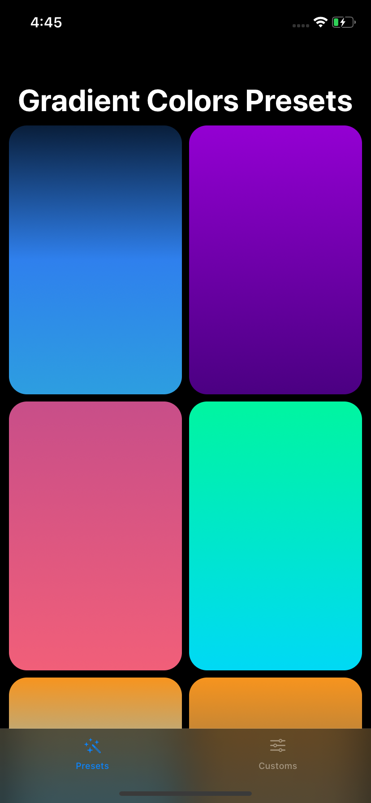
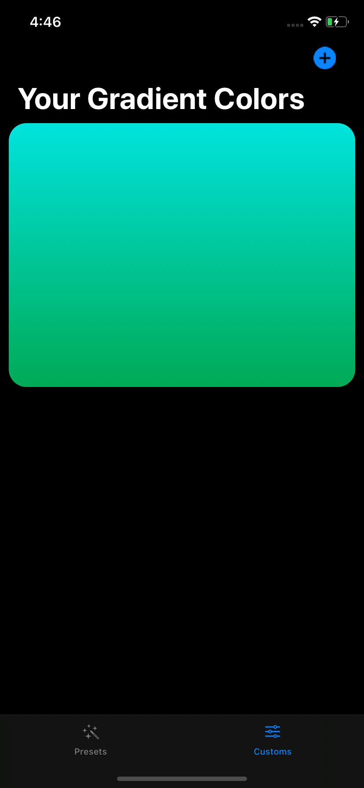
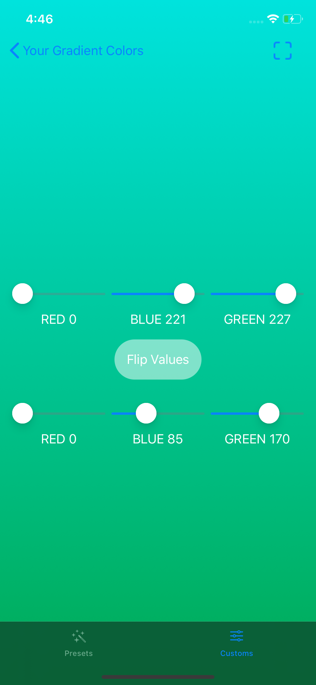

# Gradient Background Maker

A gradient background app made with SwiftUI, with preloaded gradients and feature to make custom linear gradient.

## Features

- preloaded gradients
- make your own gradient
- mark gradient as favourite
- share and save gradients
- hex codes available
- supports dark mode

## Screenshots

##### Preset gradients screen

##### Custom gradients screen

##### Custom gradient create screen

